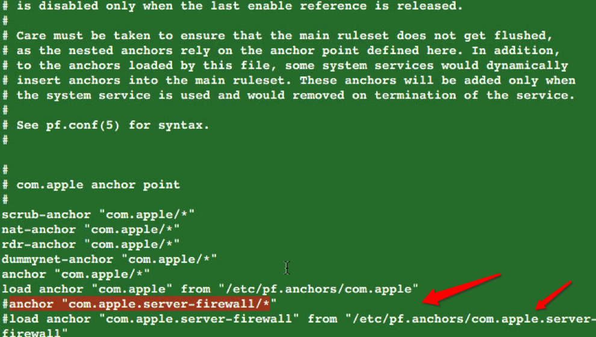

#Mac built-in Firewall

Starting from version 10.7 (Lion), Mac OS X includes 2 firewalls: PF & Application Firewall. Both are disabled by default.

PF on Mac OS X
https://pleiades.ucsc.edu/hyades/PF_on_Mac_OS_X

This settings below, make the mac computer cannot be connected from outside:

http://murusfirewall.com/forum/viewtopic.php?t=406